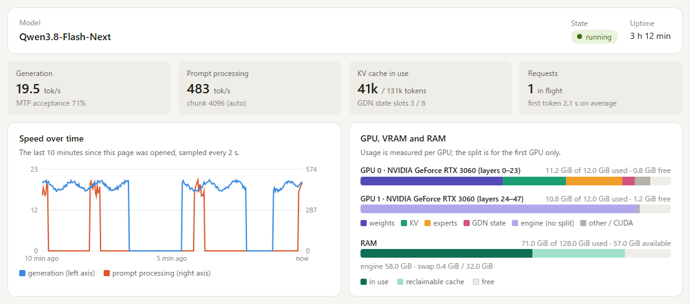
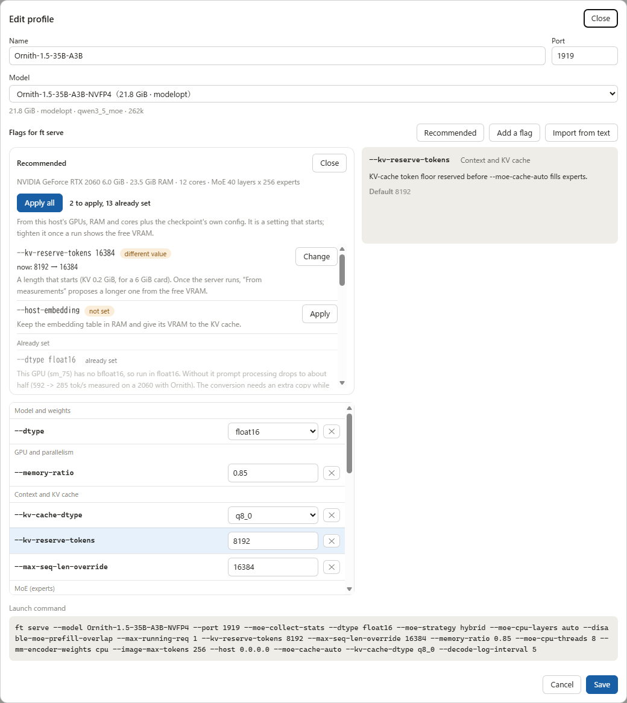
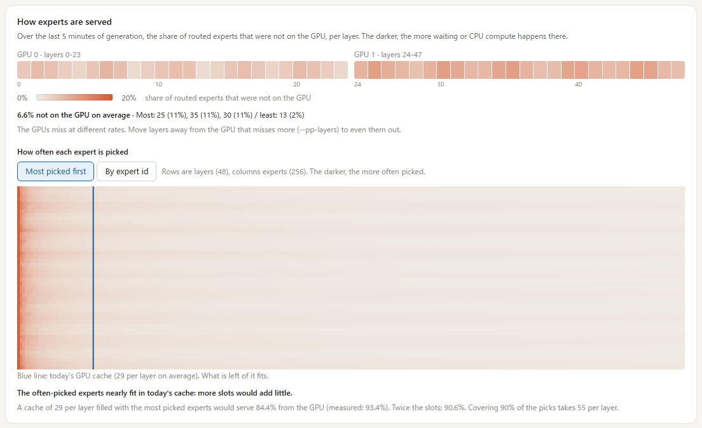

# The web console (`ft mgr`)

Upstream ships a desktop app that talks to `ft daemon`. It is built for upstream's engine and does
not know this fork's flags, so this fork serves its own console to a browser instead: nothing to
install on the machine you look from.



## Two commands, two ports

| | `ft daemon` (upstream, unchanged) | `ft mgr` (this fork) |
|---|---|---|
| Port | 1900 | 1901 |
| State directory | `~/.freetoken/daemon` | `~/.freetoken/mgr` |
| Web console at `/ui/` | no | yes |
| Launch profiles, recommended settings, suggestions | no | yes |
| Start, stop, switch, logs | yes | yes |
| From another PC | `--token` guards every route | anyone may look, operating needs the token |

`ft mgr` is the same supervisor as `ft daemon` with the console added on top. It has its own
port and state directory, so both can be installed side by side.

Port 1901 rather than 1900: on Windows the SSDP Discovery service holds 1900, and under WSL's
mirrored networking a listener on 1900 is unreachable even from inside WSL.

```bash
ft mgr --host 0.0.0.0
```

Then open `http://127.0.0.1:1901/ui/` on this PC, or `http://<this PC>:1901/ui/` on another one.
Use `127.0.0.1` rather than `localhost` when the server runs in WSL: `localhost` resolves to `::1`
first, which does not reach WSL. Stopping `ft mgr` leaves a running engine alone, and the next
`ft mgr` takes it over; `ft mgr stop` stops the engine itself.

`ft serve` serves the same dashboard on its own port (`http://<host>:<port>/ui/`), read-only:
no profiles, no start or stop. A server started from a script is still shown by `ft mgr` when it
listens on the default port 1919, marked as not managed by it.

Add `?demo` to the URL to see every panel with made-up numbers and no server.

The console follows the browser's language (English or Japanese) and can be switched from the
header.

## Watching from another PC, operating from this one

`--host 0.0.0.0` exposes the port that also starts and stops the engine. So:

- **Reading is open.** Every GET works from anywhere the port is reachable: the dashboard, the
  logs, the profiles.
- **Operating needs this PC or the token.** Starting, stopping, switching, saving or deleting a
  profile and shutting down are accepted from this PC without a token, and from anywhere else only
  with the right `X-FT-Token` header. Otherwise the answer is `403 write_needs_token`.
- "This PC" means the connection comes from a loopback address **and** the `Host` header names
  loopback (`127.0.0.1`, `localhost`, `::1`). The second half keeps a web page that rebinds its own
  name to 127.0.0.1 from counting as local.
- The token is created on first start in `~/.freetoken/mgr/token` (mode 0600). `--token` (or
  `FREETOKEN_DAEMON_TOKEN`) replaces it. Unlike `ft daemon`, where `--token` guards every route,
  `ft mgr`'s token guards only operations.
- In the console on this PC, **Token** in the header shows it with a copy button. On another PC
  the header says **view only** and the operating buttons are gone; **Operate** asks for the token
  and keeps it in that browser.

A port forward that relays LAN connections to `127.0.0.1` (for example `netsh portproxy` with
`connectaddress=127.0.0.1`) makes them look local. Forward to the WSL address instead.

## Launch profiles



A profile is a model, a port and the flags for `ft serve`, kept in `~/.freetoken/mgr/profiles.json`.

- **Model**: picked from `~/models`, the directories in `$FREETOKEN_MODELS_DIRS` and the Hugging
  Face cache. A bare folder name is resolved against the local directories on save, so it is never
  sent to the hub as a repository id.
- **Flags**: picked from `ft serve`'s own argument parser, grouped by what they touch, with the
  description of the selected flag in the right pane. A `ft serve` line from a launch script can be
  pasted in.
- **Recommended**: the flags this fork's measurements point to for this PC's GPUs, RAM and cores
  and the checkpoint's `config.json`, each with its reason. They are compared with the profile:
  **not set**, **different value** (current -> recommended) and **already set**. **Apply all**
  applies only the first two. The context length it proposes is one that starts on the card, not
  a prediction of the most that fits.
- **From measurements** (while the server runs): changes read off the running server, each
  applicable with one click: collecting expert statistics, more RAM for the expert banks, more
  expert slots from free VRAM, a longer context once the free VRAM is known, or a shorter one to
  give the expert cache more room.
- A profile row shows start for a stopped profile, and stop and restart for the running one. A
  profile edited after its server started is marked, and restarting applies the edit.

## How experts are served



- **Per layer** (with `--moe-collect-stats`, about 2% slower generation): the share of routed
  experts that were not on the GPU over the last 5 minutes, one cell per layer and one strip per
  GPU. In hybrid mode it can show the share computed on the CPU instead. The colour scale follows
  the worst layer. Below it: the average, the worst and best layers, and what to change: grow the
  cache, move layers between GPUs (`--pp-layers`), or give the CPU side more threads.
- **Per expert** (only with `--moe-stats-out <file>` and `--disable-cuda-graph`, a measurement
  setup): how often each expert was picked, one row per layer, sorted most picked first with
  today's cache size drawn as a line. Under it, what a cache of today's size and of twice that
  would hold if filled with the most picked experts, next to the measured rate, and how many
  experts per layer cover 90% of the picks.

## Where the numbers come from

Every rank writes a small JSON file every 2 seconds to `$TMPDIR/freetoken-webstats-<port>/`
(`scheduler/webstats.py`). A file rather than the reply stream, because under `--pp-size` only
rank 0 talks to the HTTP server. Device counters are copied without blocking decode, behind a
CUDA event, and read on a later tick. The server (`server/kai_api.py`) sums the ranks into
`/v1/stats`'s `kai` block and `/v1/kai/experts`. The per-expert counts go to a separate file every
10 seconds and are returned only with `?freq=true`.

## Limits

- Nothing measures how long a token waits for expert reads, so a suggestion does not come with a
  predicted tok/s gain.
- The per-expert view needs eager decode: under CUDA graphs the routing histogram is not counted.
- The cache-size estimate is the best case of filling the cache with the most picked experts; an
  LRU replay is not simulated.
- Editing a profile does not change a running server until it is restarted.
