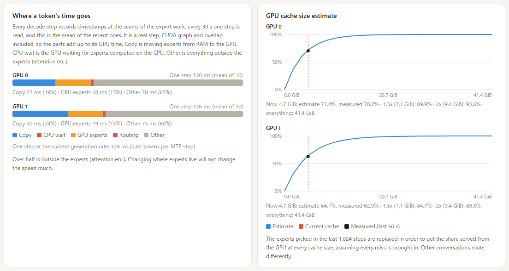

# The web console (`ft mgr`)

Upstream ships a desktop app that talks to `ft daemon`. It is built for upstream's engine and does
not know this fork's flags, so this fork serves its own console to a browser instead: nothing to
install on the machine you look from.


## Two commands, two ports

| | `ft daemon` (upstream, unchanged) | `ft mgr` (this fork) |
|---|---|---|
| Port | 1900 | 1901 |
| State directory | `~/.freetoken/daemon` | `~/.freetoken/mgr` |
| Web console at `/ui/` | no | yes |
| Launch profiles, recommended settings, suggestions | no | yes |
| Start, stop, switch, logs | yes | yes |
| From another PC | `--token` guards every route | anyone may look, operating needs the token |

`ft mgr` is the same supervisor as `ft daemon` with the console added on top. It has its own
port and state directory, so both can be installed side by side.

Port 1901 rather than 1900: on Windows the SSDP Discovery service holds 1900, and under WSL's
mirrored networking a listener on 1900 is unreachable even from inside WSL.

```bash
ft mgr --host 0.0.0.0
```

Then open `http://127.0.0.1:1901/ui/` on this PC, or `http://<this PC>:1901/ui/` on another one.
Use `127.0.0.1` rather than `localhost` when the server runs in WSL: `localhost` resolves to `::1`
first, which does not reach WSL. Stopping `ft mgr` leaves a running engine alone, and the next
`ft mgr` takes it over; `ft mgr stop` stops the engine itself.

`ft serve` serves the same dashboard on its own port (`http://<host>:<port>/ui/`), read-only:
no profiles, no start or stop. A server started from a script is still shown by `ft mgr` when it
listens on the default port 1919, marked as not managed by it.

Add `?demo` to the URL to see every panel with made-up numbers and no server.

The console follows the browser's language (English or Japanese) and can be switched from the
header.

## Watching from another PC, operating from this one

`--host 0.0.0.0` exposes the port that also starts and stops the engine. So:

- **Reading is open.** Every GET works from anywhere the port is reachable: the dashboard, the
  logs, the profiles.
- **Operating needs this PC or the token.** Starting, stopping, switching, saving or deleting a
  profile and shutting down are accepted from this PC without a token, and from anywhere else only
  with the right `X-FT-Token` header. Otherwise the answer is `403 write_needs_token`.
- "This PC" means the connection comes from a loopback address **and** the `Host` header names
  loopback (`127.0.0.1`, `localhost`, `::1`). The second half keeps a web page that rebinds its own
  name to 127.0.0.1 from counting as local.
- The token is created on first start in `~/.freetoken/mgr/token` (mode 0600). `--token` (or
  `FREETOKEN_DAEMON_TOKEN`) replaces it. Unlike `ft daemon`, where `--token` guards every route,
  `ft mgr`'s token guards only operations.
- In the console on this PC, **Token** in the header shows it with a copy button. On another PC
  the header says **view only** and the operating buttons are gone; **Operate** asks for the token
  and keeps it in that browser.

A port forward that relays LAN connections to `127.0.0.1` (for example `netsh portproxy` with
`connectaddress=127.0.0.1`) makes them look local. Forward to the WSL address instead.

## Launch profiles


A profile is a model, a port and the flags for `ft serve`, kept in `~/.freetoken/mgr/profiles.json`.

- **Model**: picked from `~/models`, the directories in `$FREETOKEN_MODELS_DIRS` and the Hugging
  Face cache. A bare folder name is resolved against the local directories on save, so it is never
  sent to the hub as a repository id.
- **Flags**: picked from `ft serve`'s own argument parser, grouped by what they touch, with the
  description of the selected flag in the right pane. A `ft serve` line from a launch script can be
  pasted in.
- **Recommended**: the flags this fork's measurements point to for this PC's GPUs, RAM and cores
  and the checkpoint's `config.json`, each with its reason. Once the model has been benchmarked on
  this PC, the benchmark's measured flags take their place (see [Benchmark](#benchmark)). They are
  compared with the profile: **not set**, **different value** (current -> recommended), **drop**
  (a flag the benchmark removed) and **already set**. **Apply all** applies all but the last. The
  context length the rules propose is one that starts on the card, not a prediction of the most
  that fits.
- **From measurements** (while the server runs): changes read off the running server, each
  applicable with one click: collecting expert statistics, more RAM for the expert banks, more
  expert slots from free VRAM, a longer context once the free VRAM is known, or a shorter one to
  give the expert cache more room.
- A profile row shows start for a stopped profile, and stop and restart for the running one. A
  profile edited after its server started is marked, and restarting applies the edit.

## Benchmark


**Benchmark** in the header measures this PC with a model and settles the flags on the numbers,
drawn live on a speedometer while it runs. It needs the GPU: the server `ft mgr` runs is stopped
first and started again with its own settings at the end, whether the run finished, failed or was
cancelled. A server started outside `ft mgr` is not touched, and the benchmark refuses to start
while one holds the GPU.

1. **Upstream's measurement** (a few minutes per GPU): `ft bench bw --gpu <n>` runs as it is, the
   same command the desktop app runs, on every GPU. It rewrites the profile the engine reads
   (`~/.cache/freetoken/benchbw/<gpu-uuid>.json`: hybrid or offload per expert format, and the
   hybrid fetch split), so everything after it runs on figures measured with this version. The
   version is written into the profile; the setup card lists each GPU's profile with the version
   that measured it, and a profile from the desktop app or an older `ft bench bw` shows none.
2. **Hardware** (a few minutes, `webui/hwbench.py` in a child process): how much host RAM this
   machine will page-lock, PCIe transfer per GPU against the link's theoretical rate, the memory
   read rate, reading the model's own file from the SSD with its page cache dropped, the model's
   experts computed on the CPU at each thread count, the experts moved to each GPU, and both at
   once. These are upstream's `ft bench bw` kernels driven with the model's own expert geometry.
   - Page-locking comes first, in a child of its own, and before anything else pins: the cap is a
     quota every process shares and the transfer steps hold pinned buffers, so measuring it later
     would answer for what this run was already holding. It writes the same record `ft doctor pin`
     does, so a machine that has been benchmarked needs nothing from that command. It changes a
     plan only when the driver refuses: that refusal is this host's cap and every later start
     plans `--moe-cpu-layers auto` against it. A ladder that merely ran out of RAM records
     nothing -- see [kai.md](kai.md#known-limitations) for why that figure is not a budget.
   - `--moe-strategy`: `hybrid` when computing on the CPU is more than twice the transfer to the
     slowest GPU, `offload` otherwise (upstream's rule) -- except where the banks are larger than
     this machine can page-lock, since a plain `offload` start pins every one of them and would
     not come up at all. There it stays `hybrid`, and the `offload` trial is skipped and listed
     with the reason.
   - `--moe-cpu-threads`: the fewest threads within 95% of the best, not the maximum.
   - These figures stay in the result; the profile is `ft bench bw`'s alone.
3. **Real runs** (optional). Setting A is the recommended settings plus the above. Each later run
   is a fresh `ft serve` with one thing changed from the best so far (`webui/search.py`); what is
   kept is carried on and can open or close later candidates (a chunk budget of 0.9 is tried only
   after 0.75 was kept).
   - **Prompt processing**: two prompts cut from this repository's own documents and code, trimmed
     with the model's tokenizer to 16,384 tokens or to what the context allows. Every run reads the
     same two texts: on two RTX 3060s one 16k excerpt ran at 509 tok/s and another at 636 under the
     same flags, so different text per run would outweigh most settings. Only the first line differs
     per run, so nothing comes from the prefix cache.
   - **Generation**: one untimed warm-up, then the best of three 300-token generations continuing
     prose, and, for a model with MTP weights, the same on Python, where MTP drafts far better. An
     MTP model is measured on Python in every run, not only the MTP ones, and a verdict compares
     prose with prose and code with code. The
     first 60 tokens of each are not timed (the expert cache is still filling for that text), and
     the best rather than the median counts because other programs on a PC in daily use only ever
     slow a run down.
   - **Kept**: a change is kept when prompt processing gains 5% or generation gains 3% while the
     other holds (90% for prompt processing, 97% for generation), whatever the change was tried for.
     A 16-bit KV cache is tried for generation, yet on two RTX 3060s it doubled prompt processing.
   - **Measured twice**: a change that clears the bar is started and measured again, and is kept
     only when that run clears it too. The slower figures of the two become the bar for what
     follows, so one lucky run cannot raise it.
   - **Generation that swings**: a change that gained prompt processing but fell short on
     generation, by no more than 20%, is judged again against the current settings started once
     more right then. On an RTX 2060
     that also drives the display, generation for the same flags ranged from 28 to 38 tok/s between
     starts.
   - **A run that fails** is marked failed and the next one starts. A server whose backend died
     cannot answer the stop's accounting request, so the switch is then forced; a prompt is given up
     when its progress counter stands still for 5 minutes or cannot be read for 1 minute.
   - **Standard** tries the settings with the largest effects on the machines this fork was measured
     on (an RTX 2060 and two RTX 3060s): offload instead of hybrid, the CPU thread count, each
     expert kernel this PC can run, a 16-bit KV cache, prefill overlap, a chunk budget of 0.75, four
     prefill pieces, moving the pipeline split one layer, pinned PLE, MTP 3 and 5. Other hardware can
     differ, which is what thorough is for.
   - **Thorough** adds the finer settings, which did not help on those machines: computing every
     missing expert on the CPU, the linear kernels, a q4_0 KV cache, device-side copies of cache
     hits, chunk budget 0.9, one piece, a 16k prefill length, no host embedding, bf16 dense weights,
     the split moved two layers, `--pp-send-ahead` and `--pp-prefill-group`.
   - Kernels this PC cannot run are not started: marlin without vLLM, b12x below sm_120. They are
     listed with the reason among what was not measured.
   - **Main use** (prose, code or both) decides a change that helps one and hurts the other, such
     as MTP.
   - Longer context tiers come last, on everything kept, and are kept while generation stays
     within 5% and prompt processing within 10%. A pre-Ampere card whose model does not load in
     float16 is retried without `--dtype` (only a failed load, not a failed measurement).
   - Not searched, with the reason on the result page: `--memory-ratio` (the risk is later VRAM use
     by other programs, which a benchmark cannot see), `--max-running-req` and
     `--cuda-graph-max-bs` (throughput, not one person's speed), `--moe-cpu-layers` and
     `--attention-backend` (auto already picks what starts), and the settings that decide what fits
     rather than how fast.
   - Time depends on the GPUs and the model: two RTX 3060s with Flash-Next take about 1.5-2 hours in
     standard mode and about 3 in thorough mode (29 starts of about 6 minutes each), an RTX 2060
     with Ornith about an hour in standard mode. While it runs, the header shows the time left,
     worked out from the runs so far.

While it runs, the dial shows the reading being taken, the chart under it the readings of that step
over time (or per thread count), and the list one row per run with its figures and verdict; the
candidates not tried yet are listed below as planned.

The recommended settings in a profile follow the last benchmark of that model: its measured flags
and reasons win over the rules, changes it tried and did not keep are not offered, and a flag it
dropped is offered for removal. A benchmark from another version asks to be run again.

The result lists each flag as **measured** or **rule** with its reason, and can be saved as a new
profile, merged into a profile for the same model, or started directly. The last result per model
is kept in `~/.freetoken/mgr/tune/`.

## How experts are served


The counters behind this section and the next two are on by default (`--no-moe-collect-stats`
turns them off; on an RTX 2060 the generation rate with and without them stayed within the run-to-run noise, and the added GPU work measured about 0.06 ms per step).

- **Per layer**: the share of routed
  experts that were not on the GPU over the last 5 minutes, one cell per layer and one strip per
  GPU. In hybrid mode it can show the share computed on the CPU instead. The colour scale follows
  the worst layer. Below it: the average, the worst and best layers, and what to change: grow the
  cache, move layers between GPUs (`--pp-layers`), or give the CPU side more threads.
- **Per expert**: how often each expert was picked over the last 5 minutes, CPU layers included,
  one row per layer, sorted most picked first with
  today's cache size drawn as a line. Under it, what a cache of today's size and of twice that
  would hold if filled with the most picked experts, next to the measured rate, and how many
  experts per layer cover 90% of the picks.

## Where a token's time goes



Each decode graph is captured twice: as usual, and once more with CUDA events recorded at the start
and end of the step and at the seams of every MoE layer's expert work. Every 30 seconds of
generation the second copy runs one step instead of the first, and the card shows where that step's
GPU time went, as the mean of the last ten readings per GPU: the cache bookkeeping (routing),
copying missed experts from RAM to the GPU, the expert GEMMs on the GPU, waiting for the experts
computed on the CPU (a whole CPU layer, or the hybrid CPU share past the GPU's own work), and the
rest (attention, dense layers, the head). It is a real step, with the graph and the overlap, so the
parts add up to it; the time per token from the generation rate is printed under the bar for
comparison, and one of the parts gets a suggestion when it dominates. The events live only in the
second copy (they cost about 1 us each on the GPU), so the other steps carry none; the copy shares
the first one's memory pool. `FREETOKEN_DECODE_SAMPLE_S` sets the interval (0 turns the second
copy off). Where a verify window or a decode step runs without a graph (for example `--spec-mtp`
on a card whose capture fails), the same events are recorded eagerly on the sampled step, and the
parts then include the launch gaps.

## GPU cache size estimate

Each GPU's expert cache records which experts every layer used in the last 1,024 decode steps
(`FREETOKEN_ROUTE_RING_STEPS`). The console replays them in decode order and computes, for every
cache size at once, the share an LRU cache of that size would have served from the GPU (the LRU
stack distance of each access). The chart runs from no cache to every expert of the GPU's layers,
with today's size and the measured rate of the last minute marked; the line under it reads off
1.5x and 2x today's size in GiB. It assumes every miss is brought into the cache, which plain
offload does and hybrid does only for part of the misses, so under hybrid the measured rate sits
below the line. CPU layers never take a slot and are left out, as is the MTP draft head.

## Where the numbers come from

Every rank writes a small JSON file every 2 seconds to `$TMPDIR/freetoken-webstats-<port>/`
(`scheduler/webstats.py`). A file rather than the reply stream, because under `--pp-size` only
rank 0 talks to the HTTP server. Device counters are copied without blocking decode, behind a
CUDA event, and read on a later tick. Each rank also reports the VRAM of its own KV cache, expert cache and GDN
state, read from its allocated pools, so under `--pp-size` every GPU's bar is split, not only the
first one's. The server (`server/kai_api.py`) sums the ranks into `/v1/stats`'s `kai` block and
`/v1/kai/experts`. The per-expert counts go to a separate file every
10 seconds and are returned only with `?freq=true`; the routing record goes to
`rank<N>.routes.npz` on the same beat and is replayed by `/v1/kai/slots` (`webui/slot_estimate.py`).
The counting runs on the GPU inside the kernels the decode step launches anyway (the hybrid cache
kernel) or in one small kernel per layer (`record_routes`), so it is part of the captured graph.

## Limits

- The time breakdown says which part is large, not how much a change would gain: the parts
  overlap differently once one of them shrinks, so a suggestion still does not come with a
  predicted tok/s.
- The cache estimate replays one workload's last thousand steps; another kind of conversation
  routes differently.
- The cache-size estimate is the best case of filling the cache with the most picked experts; an
  LRU replay is not simulated.
- Editing a profile does not change a running server until it is restarted.
